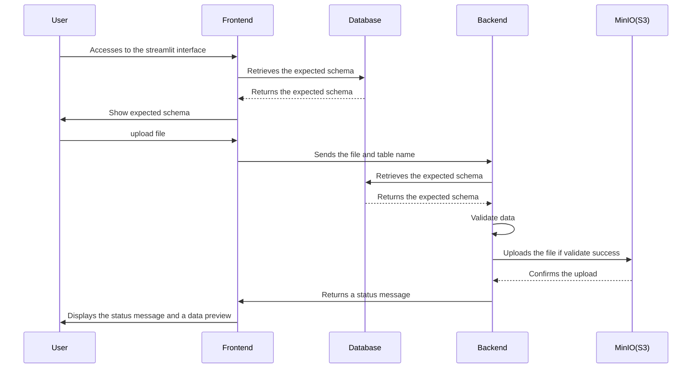

# Data Ingestion Platform

## Description
This data ingestion platform streamlines data collection from various departments (e.g., marketing, sales, operations) within an organization. Designed for departments without dedicated technical staff, it enables easy data contribution via CSV uploads through a user-friendly web interface. The platform ensures data quality through schema validation.

## Setup (using Docker Compose)

1. Ensure Docker and Docker Compose are installed on your system.
2. Clone this repository to your local machine.
3. Navigate to the project directory in your terminal.
4. Start the application using:

```bash
docker compose up --build -d
```

This command builds the Docker image and starts the application containers.

## Usage

### Service Interaction Sequence Diagram



1.  **Access the Web Interface:** Once the application is running (see Setup), open your web browser and navigate to `http://localhost:8501`.
    
    

2.  **Select a Table:** Choose the table you want to upload data to from the dropdown menu.
    

3.  **Upload CSV Files:**
    *   Click the "Choose File" button to select a CSV file from your local machine.
    

4.  **Data Validation:** The platform validates the uploaded data against a predefined schema.
    *   **Validation and Preview:** Uploaded CSV files are validated against the schema, and a preview is displayed.
    *   If the data is valid, a success message will be displayed. If the data is invalid, an error message will be displayed.
        
        
5.  **Upload Successful:** After the data is successfully validated, it can be uploaded to the S3 bucket.(we use minio for alternative storage)
    *   **Upload Successful:** After the data is successfully validated, it can be uploaded to the S3 bucket.
    
    
## Limitations

Please note the following limitations:

1. This is a proof-of-concept project and many features are still under development.
2. Supported data types are limited to: `string`, `integer`, `float`, `datetime(YYYY-MM-DD HH:mm:ss)`
3. Files are currently stored to Minio, which is a lightweight S3 alternative.
